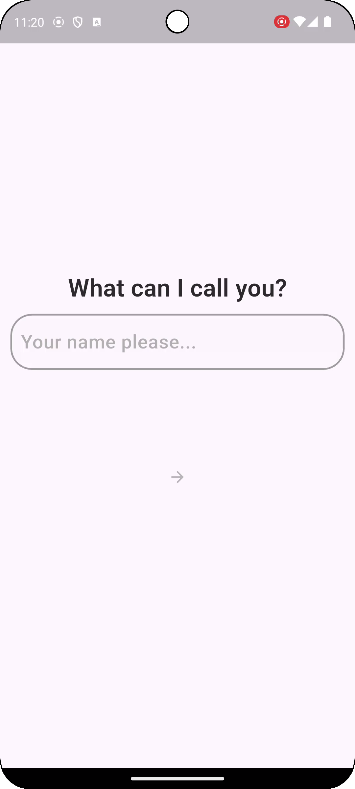
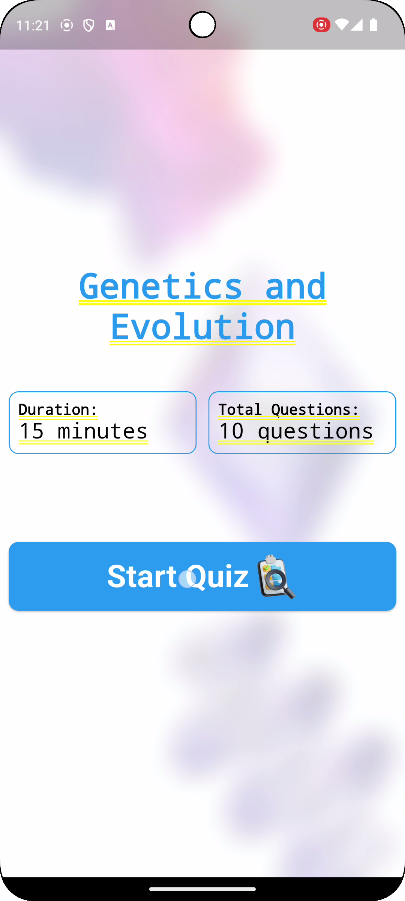
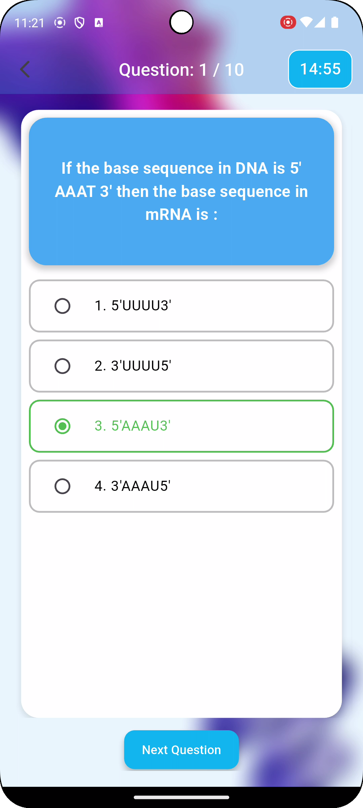
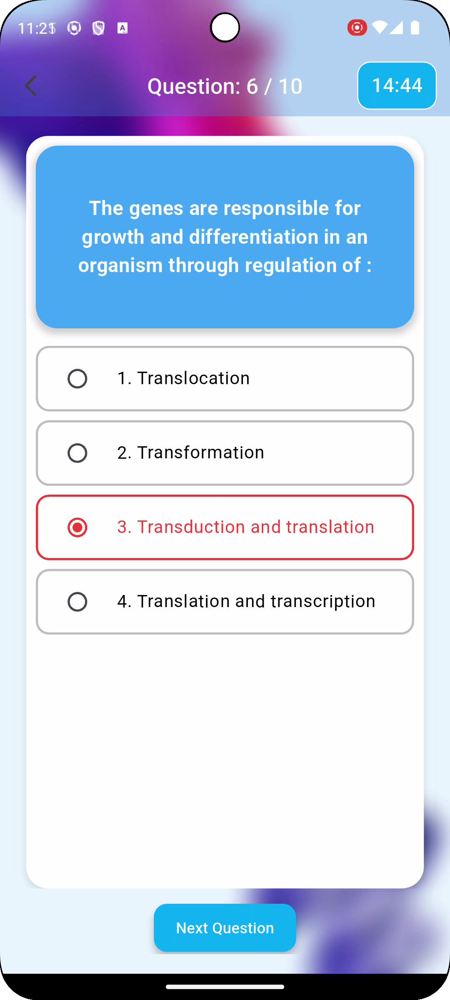
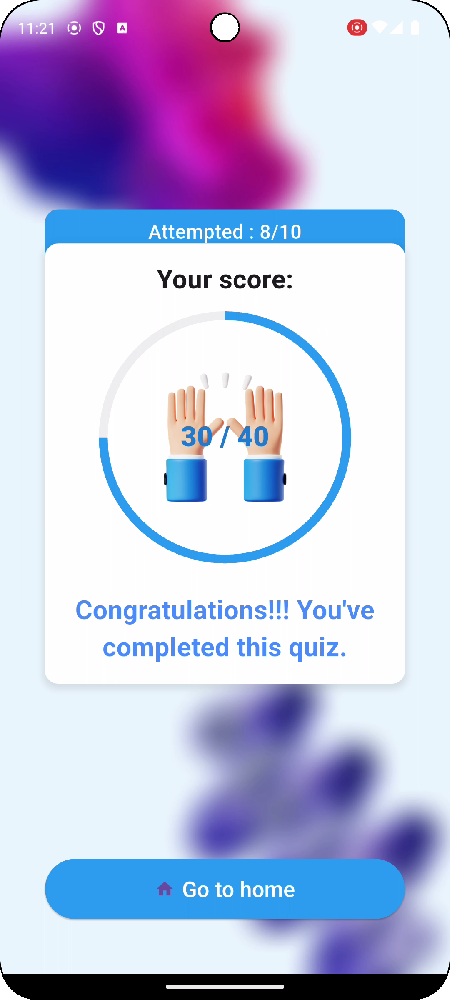

# Testmime Quiz App

Testmime is a quiz application that allows users to take quizzes, track scores, and view results. The app utilizes the **MVC (Model-View-Controller)** architecture for better separation of concerns. The application also integrates a timer, score tracking mechanism, and Lottie animations for visual enhancement.

## Screenshots

Below are some screenshots from the app:
### Screenshots










(*Replace the placeholder URLs with actual image URLs in your repository or local directory*)

## Technologies Used

- **Programming Language**: Dart
- **Framework**: Flutter
- **State Management**: GetX
- **UI**: Flutter's Material Design
- **Architecture**: MVC (Model-View-Controller)
- **Packages**:
    - `get: ^4.6.5`
    - `flutter: ^2.10.4`
    - `flutter_localizations: ^2.10.4`
    - `lottie: ^2.0.0`
    - `http: ^0.13.3`

## Project Structure

- **Model**: Contains the data models for the quiz questions and options.
- **View**: The user interface, built using Flutter widgets.
- **Controller**: The logic that handles the interaction between the model and view, including state management using GetX.

## Installation & Setup

1. **Clone the Repository**

   ```bash
   git clone https://github.com/Koenisegg484/Testmime.git

2. **Navigate to the Project Directory**

   After cloning the repository, navigate into the project directory:

   ```bash
   cd Testmime

3. **Install Dependencies**

   Run the following command to install the required dependencies:

   ```bash
   flutter pub get

4. **Run the Project**

  To run the project, use the following command:
  
  ```bash
  flutter run

Ensure you have a connected device or an emulator running to view the app.

## How to Use the App

1. **Start the Quiz**:  
   Upon launching the app, you will see the home screen. Tap on the "Start Quiz" button to begin the quiz.

2. **Answer the Questions**:  
   As you proceed through the quiz, select the appropriate answer for each question. The timer will start, counting down as you progress.

3. **Navigation**:  
   You can navigate between questions using swipe gestures or the provided buttons.

4. **View the Score**:  
   Once you've completed all questions or the timer runs out, your score will be displayed.

## Features

- **Timer**: A countdown timer to keep track of the quiz duration.
- **Score Tracking**: Calculates and displays your score based on your answers.
- **Lottie Animations**: Enhances the user experience with smooth and engaging animations.

